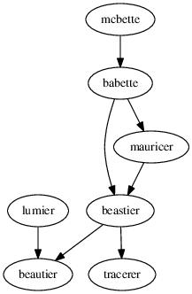

# FAQ

## Package

### What are the dependencies?

`mcbette` depends on (non-CRAN) packages like this:



## Troubleshooting

### My run takes longer than one hour

Travis CI gives you one hour of computation time. 

If your alignment needs more time, one can:

 * get [a Travis CI paid plan](https://travis-ci.com/plans)
 * use less different site, clock and/or tree models
 * use a shorter alignment
 * use an alignment with less taxa

## Misc

### How to create the dependency graph from the `.dot` file?

```
dot -Tps dependencies.dot -o dependencies.ps
convert dependencies.ps dependencies.png
```

## References

Article about `babette`:

 * Bilderbeek, Richel JC, and Rampal S. Etienne. "babette: BEAUti 2, BEAST 2 and Tracer for R." Methods in Ecology and Evolution (2018). https://doi.org/10.1111/2041-210X.13032
