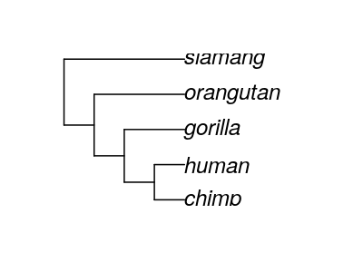
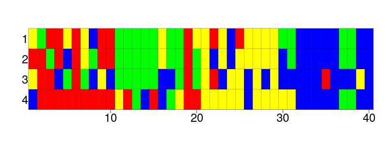

> Example text below

# Summary

All life on Earth is related to one another.
We, humans, inherit our characteristics from our parents, which they
inherted from theirs. Going back in time long enough (say, between 4-7 million
years), we'll arrive at the ancestors that gave rise to both humans and chimps.
At that early time, the human-chimp-ancestor mixed their heritable
features freely, as all members of that species could produce offspring with
another of the opposite gender. Alas, this would not last, as the 
human-chimp-ancestor evolved into to seperate species. From that moment on,
newly evolved features in humans, would stay in humans only.

> The evolutionary relationship between primates,
> going from the past (left) to the present (right).
> It shows that humans and chimps are the two species that are closest related.
> H = Human, C = Chimp, G = Gorilla, O = Orangutan, S = Siamang.

The evolutionary history of species leaves its traces in DNA, the 
heritable material that contains the blueprint of an organism's features.
The DNA consists of a 4 letter alphabet, which encodes the features of an organism.
Each letter of this alphabet is named after one of the four nucleotides, 
that are the encoding part of a DNA molecule.
The DNA we have in our cells are a mix between our mother's and father's DNA,
with a few novel mutations added.
Because -at least theoretically- any human woman can produce offspring with 
any human man, the DNA of our species gets mixed and novel mutations can
spread through our population. As a consequence,
the DNA between humans is more simular, then when compared to the DNA of any 
other species. 

> Schematic figure of the DNA sequences of 4 hypothetical species.
> Species are numbered 1 to 4.
> Of each species, 40 nucleotides are known.
> Cells with identical colors depict the same nucleotide.

Nowadays, we know the DNA sequences of many species. With these genetic
codes, we should be able to reconstruct the evolutionary history of all 
species. An evolutionary history is commonly depicted by a tree-like
figure, called a phylogeny, or simply 'tree'. The field of phylogenetics 
aims to construct the 'best' phylogeny from a the genetic codes of species.

> phylogenetics in a nutshell: deriving the evolutionary history
> of species (at the right) from their DNA sequences (at the left)

Constructing a phylogeny, however, is non-trivial, due to the many ways
to do so. A researcher needs to pick one model of how evolution works,
for example, how DNA mutates, how mutations vary between different species
and how frequent speciations and extinctions are. The problem is, that there 
are many models to pick from.

> ``mcbette`` logo

``mcbette`` is an R package that helps to pick the 'best' model. 
The 'best', in this context, is the model that is 'simple enough, but not 
simpler'. In more precise term, ``mcbette`` does a model comparison (hence 
the `mc`) between multiple suggested evolutionary models and shows
which one is best. The winner of this comparison is assumed to result
in the best phylogenies, with the same definition of 'best'.

To go into more detail: ``mcbette`` estimates the marginal likelihood of an
evolutionary model, from a given alignment. 
The marginal likelihood, also called 'evidence',
is a measure of probability that the evolutionary model will result in
the given alignment. Marginal likelihoods can be compared directly
across models, as they have the same unit, regardless of the complexity
of the evolutionary model. Additionally, the marginal likelihood
of models with more parameters are in a natural way penalized for being 
complex. In other words: the highest marginal likelihood will be found 
for models that are justifiably complex, instead of the model that has the
most parameters.

|site_model_name |clock_model_name |tree_prior_name | marg_log_lik| marg_log_lik_sd|    weight|
|:---------------|:----------------|:---------------|------------:|---------------:|---------:|
|JC69            |strict           |yule            |    -179.9266|        2.427167| 0.2823000|
|HKY             |strict           |yule            |    -182.2376|        1.992356| 0.0279950|
|TN93            |strict           |yule            |    -179.0459|        2.446301| 0.6810869|
|GTR             |strict           |yule            |    -183.4157|        2.636430| 0.0086181|

> Example ``mcbette`` output of a model comparison of four evolutionary models.
> The first three columns summarize the evolutionary model, which consists of
> a site model, clock model and tree prior. 
> The last three columns show the result of a ``mcbette`` run,
> showing the estimated marginal likelihood, the error in this estimation
> and the relative model weight.
> The 'best' model is the third model, as it has the highest relative model weight.

``mcbette`` is aimed to be used by anyone interested in phylogenetics.
``mcbette`` builds heavily upon the ``babette`` R package [@Bilderbeek:2018],
where ``babette`` is an R package to call the phylogenetic 
tool 'BEAST2' [@Bouckaert:2019]. Additionally, ``mcbette`` uses the novel 'NS'
'BEAST2' package [@Russel:2019] to do the actual model comparison.
With ``mcbette`` it will be 'as easy as possible, but not easier' to pick a 
best evolutionary model.

# Citations

Citations to entries in paper.bib should be in
[rMarkdown](http://rmarkdown.rstudio.com/authoring_bibliographies_and_citations.html)
format.

 * `@Bilderbeek:2018`: Bilderbeek, Richèl JC, and Rampal S. Etienne. "babette: BEAUti 2, BEAST 2 and Tracer for R." Methods in Ecology and Evolution (2018). https://doi.org/10.1111/2041-210X.13032
 * `@Bouckaert:2019` Bouckaert R., Vaughan T.G., Barido-Sottani J., Duchêne S., Fourment M., Gavryushkina A., et al. (2019) BEAST 2.5: An advanced software platform for Bayesian evolutionary analysis. PLoS computational biology, 15(4), e1006650.
 * `@Russel:2019` Russel, Patricio Maturana, et al. "Model selection and parameter inference in phylogenetics using nested sampling." Systematic biology 68.2 (2019): 219-233.

